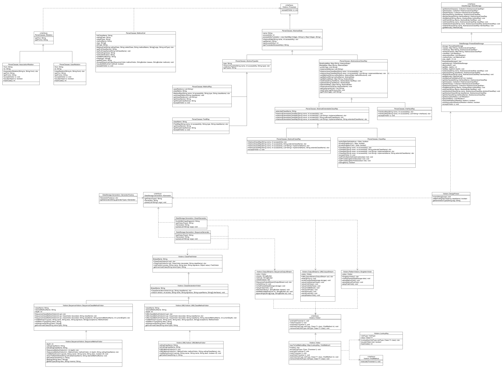
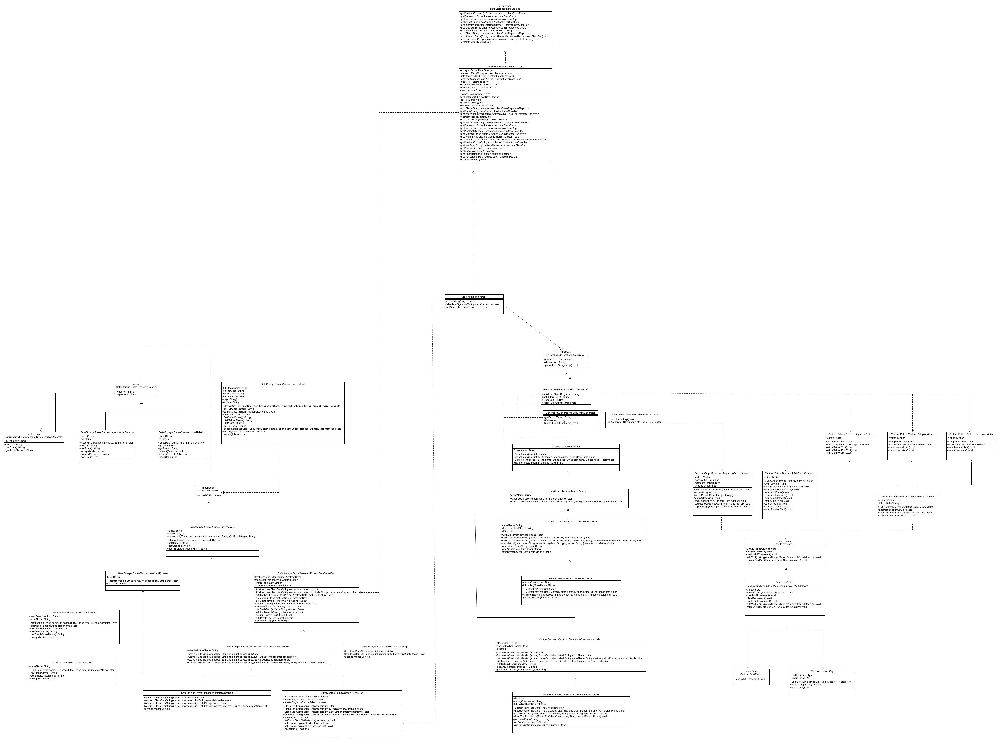

# UMLCreator
Project for CSSE 374

##Design
###Milestone 1

We are using the visitor and decorator patterns to parse compiled Java code and create UML diagrams.  In the current state we are able to parse Interfaces and classes and methods and fields inside each.
This project uses ASM for bytecode parsing and dot by graphviz for creating the UML diagrams.

###Milestone 2

Our design has not changes much since Milestone two, as we were already storing the data needed for this milestone, but not using it yet. However, we have internally reorganized much of our code to make it more scalable. Much of this reorganization is focused on our data storage classes to better share code that does not change between classes. 

###Milestone 3

We added functionality to allow for the creation of sequence diagrams using a tool called [SdEdit](http://sdedit.sourceforge.net/) This tool allows you to create sequence diagrams from text files.  We also did some refactoring, changing the UML creation to use a visitor, restructuring how java files are stored internally, and adding a generator (with a factory) to let us more easily specify the type of diagram to generate.

###Milestone 4

First, to make our code more modular we made two different types of class method visitors and MethodVisitors, which allows us to change functionallity easily with no code duplication. We also moved some stuff around in DesignParser to make our code more modular, as all of the parsing code is now in the generator classes as well as setting up the printing.
We also fixed the visitors for our model, to make it so that you can swap out different type of printing if we need to print UMLs differently in the future.
Finally, to detect singleton we created another Model visitor which will looks for classes with private constructors, a private static field of itself, and a public getter method with the return type of the class. 

##Milestone 5

We refactored our detection visitors to be more modular and easily expandable by programmers using our library. We used the Template pattern to define an algorithm for how all pattern detection visitors should function, and always pass in our data storage so that any user can access the entirety of our model. We also fixed up our singleton pattern detection to be less coupled with our model and added test cases. 
We implemented the fundamental logic of our adaptor and decorator pattern recognition code. 

##Milestone 6

We realized that we had to do a lot of refactoring from the previous milestone to make our detection code much more modular and easily usable by and potential user trying to add onto our code. We realized our adaptor and decorator detection logic was flawed and fixed them in this milestone, and implemented extensive testing on both patterns. 
This milestone we were unable to implement our Composite pattern detection logic, however we set the stage for this through our refactoring. At this point we know how we want to implement this logic and have refactored our code base to make this logic a single file addition.

##How to Use
In order to use this, you will need to call our application from the command line.
the first argument should be the type of diagram you would like generated, these inputs are:

| code | result |
|:---:|:---|
| U | generate UML diagram |
| S | generage Sequence diagram |

The next parameter depends on wether you are creating a UML diagram or sequence diagram.
* if you are creating a UML diagram, specify the classes you would like to be parsed and shown on the UML.
* if you are creating a Sequence diagram, specify the method that you would like the sequence diagram to be built for.

The final argument is optional and only matters if you are making a sequence diagram.  
* if you add an integer as the last argument, it will override the default max depth of 5 and will follow each method for up to the specified level of depth.

##Work
| Milestone | Chris  |      Benjamin  |
|:---:|:----------|:-------------|
| 1 | Implement UML v1 |  Create UML v1 | 
| 1 | Parsing classes using ASM | Creating graph with Graphviz |
| 1 | test cases | toStrings |
| 2 |bug fixing and expanding ASM parsing | Bug fixing existing printing methods, implementing uses and association printing|
| 2 |refactoring data storage structure |refactoring data storage structure |
| 3 | DataStorage and update to singleton | internal data representation v2.0 |
| 3 | visitor for sequence diagram | changing UML to use Visitor |
| 3 | debug problems with parsing asm | implementation of method sequence following |
| 3 | handle different types of command line arguments||
| 4 | converted visitors to new version discussed in class | refactored ASM visitors|
| 4 | wrote singleton visitor | wrote unit tests |
| 4 | restructured packages | did bug fixes |
| 5 | bug fixes on singleton | bug fixes on singleton |
| 5 | refactoring | refactoring |
| 6 | heavily restructured packages | wrote testing code for Adaptor |
| 6 | fixes on decorator | fixes on adaptor |
| 6 | testing code on decorator | refactoring on pattern detection visitor |
| 7 | Created GUI | Work on API for connecting GUI to framework |
| 7 | Dot integration | cleaning up the framework |

